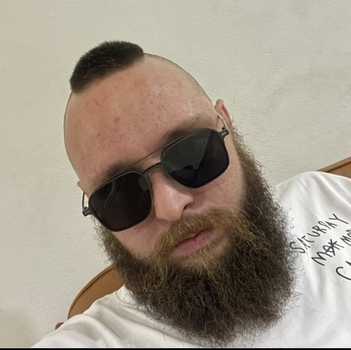

# Hi there, i'm Ivan

I am a beginner python developer

## My contacts

- [LinkedIn](https://www.linkedin.com/in/ivan-andreev-0473717a/)
- [X](https://x.com/and95026785)
- [Email](oxothuknsk@gmail.com)

## projects

### projects 1: telegram bot
[python bot](https://github.com/PandaIvan/Python_bot)
- Basic technologies: Python

### projects 2: google sheets
[google sheets](https://github.com/PandaIvan/Sheets_move)
- Basic technologies: JavaScript

### projects 3: parser
[parser](https://github.com/PandaIvan/Parser)
- Basic technologies: Python

## About myself

I always strive to improve my skills and learn new technologies. I like to work on interesting projects and solve complex problems.
